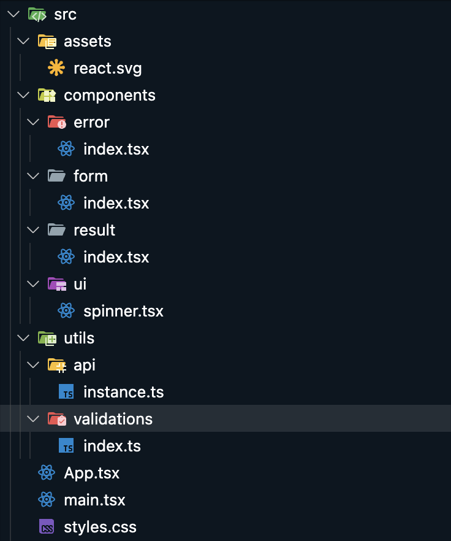

# 📊 Number Facts App

Простое и стильное одностраничное приложение (SPA) для получения интересных фактов о числах с помощью [Numbers API](http://numbersapi.com).

Приложение позволяет:

- Выбрать тип факта: **Математика**, **Тривия**, **Дата**
- Ввести конкретное число или дату
- Или получить **случайный** факт
- Получить сообщение об ошибке при некорректном вводе
- Увидеть результат на той же странице

---

## 🚀 Онлайн демо

> _(При необходимости добавьте ссылку на опубликованную версию приложения)_

---

## 🖼️ Превью

 <!-- при необходимости замените на ваш скриншот -->

---

## 📦 Стек технологий

- **React** (с хуками и функциональными компонентами)
- **TypeScript**
- **Tailwind CSS** для стилизации
- **Numbers API** для получения фактов

---

## 🛠️ Возможности

- Выбор между `Math`, `Trivia`, `Date`
- Ввод своего числа или даты, либо запрос случайного значения
- Валидация введенных данных:
    - Проверка формата даты `MM/DD`
    - Проверка числовых значений
- Уведомления об ошибках
- Загрузка и отображение результата без перезагрузки страницы

---

## 🧠 Как работает

1. Пользователь выбирает тип факта
2. Вводит число или дату (или оставляет поле пустым для случайного значения)
3. Выполняется валидация данных
4. Отправляется запрос на [Numbers API](http://numbersapi.com)
5. Факт отображается на экране

---



---

## 🧪 Правила валидации

- **Math/Trivia**:
    - Значение должно быть числом
    - Только целые числа
    - Только положительные значения

- **Date**:
    - Формат `MM/DD`
    - Корректные значения месяца и дня
    - Учет февраля и месяцев с 30 днями

---

## 🧾 Установка и запуск

```bash
# Клонируйте репозиторий
git clone https://github.com/ваш-пользователь/number-facts-app.git
cd number-facts-app

# Установите зависимости
npm install

# Запустите приложение
npm run dev
```
